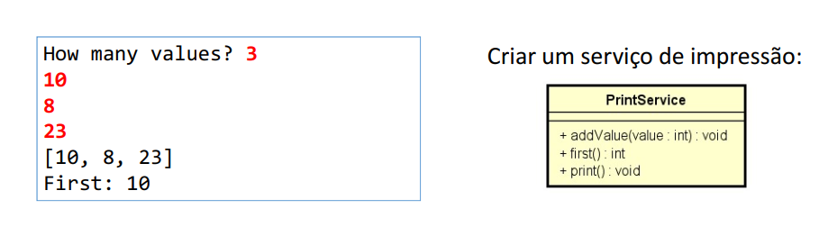
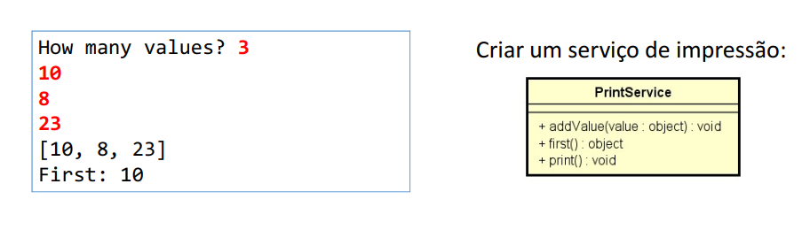
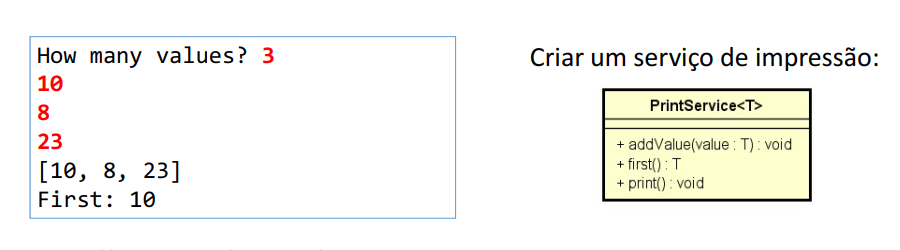
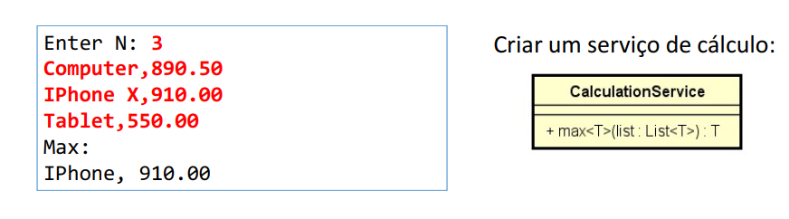
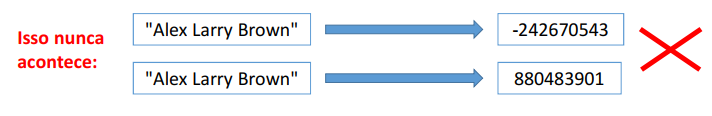

# Generics

https://docs.microsoft.com/pt-br/dotnet/standard/generics/

- Generics permitem que classes, interfaces e métodos possam ser
parametrizados por tipo. Seus benefícios são:
  - Reuso
  - Type safety
  - Performance
  
- Uso comum: coleções

### Problema motivador 1 (reuso)
Deseja-se fazer um programa que leia um conjunto de N números inteiros (N de
1 a 10), e depois imprima esses números de forma organizada conforme
exemplo. Em seguida, informar qual foi o primeiro valor informado.

 

### Problema motivador 2 (type safety & performance)
Deseja-se fazer um programa que leia um conjunto de N números inteiros (N de
1 a 10), e depois imprima esses números de forma organizada conforme
exemplo. Em seguida, informar qual foi o primeiro valor informado.

 

### solução com generics
Deseja-se fazer um programa que leia um conjunto de N números inteiros (N de
1 a 10), e depois imprima esses números de forma organizada conforme
exemplo. Em seguida, informar qual foi o primeiro valor informado.

 

## Restrições para generics

### Problema
Uma empresa de consultoria deseja avaliar a performance de produtos,
funcionários, dentre outras coisas. Um dos cálculos que ela precisa é encontrar
o maior dentre um conjunto de elementos. Fazer um programa que leia um
conjunto de N produtos, conforme exemplo, e depois mostre o mais caro deles.

 

### Restrições possíveis
https://docs.microsoft.com/en-us/dotnet/csharp/programmingguide/generics/constraints-on-type-parameters

- where T: struct
- where T : class
- where T : unmanaged
- where T : new()
- where T : <base type name>
- where T : U

 

# GetHashCode e Equals
- São operações da classe Object utilizadas para comparar se um objeto
é igual a outro
- Equals: lento, resposta 100%
- GetHashCode: rápido, porém resposta positiva não é 100%
- Os tipos pré-definidos já possuem implementação para essas
operações. Classes e structs personalizados precisam sobrepô-las.

### Equals
Método que compara se o objeto é igual a outro, retornando
true ou false.

`string a = "Maria";`
`string b = "Alex";`

`Console.WriteLine(a.Equals(b));`

### GetHashCode
Método que retorna um número inteiro representando um código gerado
a partir das informações do objeto.

`string a = "Maria";`
`string b = "Alex";`

`Console.WriteLine(a.GetHashCode());`
`Console.WriteLine(b.GetHashCode());`

### Regra de ouro do GetHashCode
- Se o código de dois objetos for diferente, então os dois objetos são
diferentes

- Se o código de dois objetos for igual, muito provavelmente os objetos
são iguais (pode haver colisão)

 

# HashSet<T> e SortedSet<T>
- Representa um conjunto de elementos (similar ao da Álgebra)
  - Não admite repetições
  - Elementos não possuem posição
  - Acesso, inserção e remoção de elementos são rápidos
  - Oferece operações eficientes de conjunto: interseção, união, diferença.

- HashSet
  https://msdn.microsoft.com/en-us/library/bb359438(v=vs.110).aspx

- SortedSet
  https://msdn.microsoft.com/en-us/library/dd412070(v=vs.110).aspx

### Diferenças
• HashSet
  • Armazenamento em tabela hash
  • Extremamente rápido: inserção, remoção e busca O(1)
  • A ordem dos elementos não é garantida

• SortedSet
  • Armazenamento em árvore
  • Rápido: inserção, remoção e busca O(log(n))
  • Os elementos são armazenados ordenadamente conforme implementação IComparer<T>

### Alguns métodos importantes
• Add
• Clear
• Contains
• UnionWith(other) - operação união: adiciona no conjunto os elementos do
outro conjunto, sem repetição
• IntersectWith(other) - operação interseção: remove do conjunto os
elementos não contidos em other
• ExceptWith(other) - operação diferença: remove do conjunto os elementos
contidos em other
• Remove(T)
• RemoveWhere(predicate)