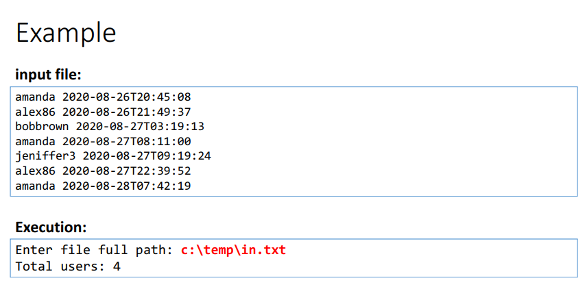
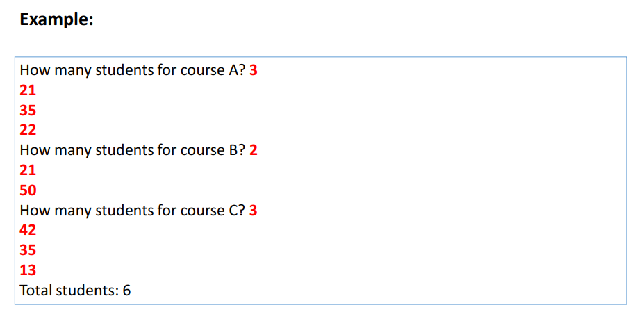
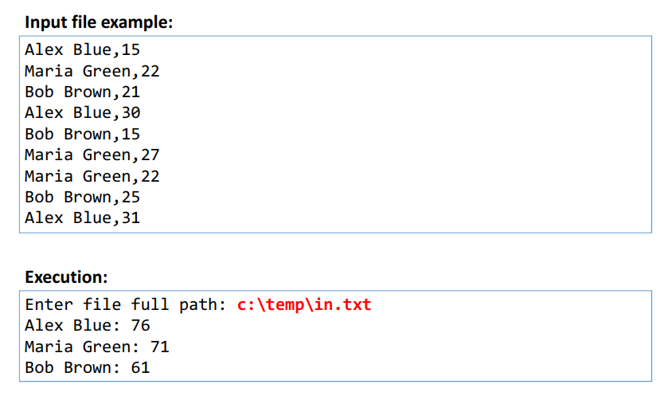

# Generics

https://docs.microsoft.com/pt-br/dotnet/standard/generics/

- Generics permitem que classes, interfaces e métodos possam ser parametrizados por tipo. Seus benefícios são:
  - Reuso
  - Type safety
  - Performance
  
- Uso comum: coleções


### Problema motivador 1 (reuso)
Deseja-se fazer um programa que leia um conjunto de N números inteiros (N de 1 a 10), e depois imprima esses números de forma organizada conforme exemplo. Em seguida, informar qual foi o primeiro valor informado.


<br>

### Problema motivador 2 (type safety & performance)
Deseja-se fazer um programa que leia um conjunto de N números inteiros (N de 1 a 10), e depois imprima esses números de forma organizada conforme exemplo. Em seguida, informar qual foi o primeiro valor informado.


<br>

### Solução com generics
Deseja-se fazer um programa que leia um conjunto de N números inteiros (N de 1 a 10), e depois imprima esses números de forma organizada conforme exemplo. Em seguida, informar qual foi o primeiro valor informado.


<br>

## Restrições para generics

### Problema
Uma empresa de consultoria deseja avaliar a performance de produtos, funcionários, dentre outras coisas. Um dos cálculos que ela precisa é encontrar o maior dentre um conjunto de elementos. Fazer um programa que leia um conjunto de N produtos, conforme exemplo, e depois mostre o mais caro deles.


<br>

### Restrições possíveis
https://docs.microsoft.com/en-us/dotnet/csharp/programmingguide/generics/constraints-on-type-parameters

- where T: struct
- where T : class
- where T : unmanaged
- where T : new()
- where T : <base type name>
- where T : U

<br>

# GetHashCode e Equals
- São operações da classe Object utilizadas para comparar se um objeto é igual a outro
- Equals: lento, resposta 100%
- GetHashCode: rápido, porém resposta positiva não é 100%
- Os tipos pré-definidos já possuem implementação para essas operações. Classes e structs personalizados precisam sobrepô-las.

### Equals
Método que compara se o objeto é igual a outro, retornando
true ou false.

```c#
string a = "Maria";
string b = "Alex";

Console.WriteLine(a.Equals(b)); // False
```

### GetHashCode
Método que retorna um número inteiro representando um código gerado a partir das informações do objeto.

```c#
string a = "Maria";
string b = "Alex";

Console.WriteLine(a.GetHashCode()); // -472526398
Console.WriteLine(b.GetHashCode()); // 1021651916
```

### Regra de ouro do GetHashCode
- Se o código de dois objetos for diferente, então os dois objetos são diferentes


- Se o código de dois objetos for igual, muito provavelmente os objetos são iguais (pode haver colisão)

<br>

# HashSet<T> e SortedSet<T>
- Representa um conjunto de elementos (similar ao da Álgebra)
  - Não admite repetições
  - Elementos não possuem posição
  - Acesso, inserção e remoção de elementos são rápidos
  - Oferece operações eficientes de conjunto: interseção, união, diferença.

- HashSet
  https://msdn.microsoft.com/en-us/library/bb359438(v=vs.110).aspx

- SortedSet
  https://msdn.microsoft.com/en-us/library/dd412070(v=vs.110).aspx

### Diferenças
- HashSet
  - Armazenamento em tabela hash
  - Extremamente rápido: inserção, remoção e busca O(1)
  - A ordem dos elementos não é garantida

- SortedSet
  - Armazenamento em árvore
  - Rápido: inserção, remoção e busca O(log(n))
  - Os elementos são armazenados ordenadamente conforme implementação IComparer<T>

### Alguns métodos importantes
- Add
- Clear
- Contains
- UnionWith(other) - operação união: adiciona no conjunto os elementos do outro conjunto, sem repetição
- IntersectWith(other) - operação interseção: remove do conjunto os elementos não contidos em other
- ExceptWith(other) - operação diferença: remove do conjunto os elementos contidos em other
- Remove(T)
- RemoveWhere(predicate)

<br>

# Dictionary e SortedDictionary

### Dictionary<TKey, TValue>
- É uma coleção de pares chave / valor
  - Não admite repetições do objeto chave
  - Os elementos são indexados pelo objeto chave (não possuem posição)
  - Acesso, inserção e remoção de elementos são rápidos

- Uso comum: cookies, local storage, qualquer modelo chave-valor

- Dictionary
  https://msdn.microsoft.com/en-us/library/xfhwa508(v=vs.110).aspx

- SortedDictionary
  https://msdn.microsoft.com/en-us/library/f7fta44c(v=vs.110).aspx

### Diferenças
- Dictionary
  - Armazenamento em tabela hash
  - Extremamente rápido: inserção, remoção e busca O(1)
  - A ordem dos elementos não é garantida

- SortedDictionary
  - Armazenamento em árvore
  - Rápido: inserção, remoção e busca O(log(n))
  - Os elementos são armazenados ordenadamente conforme implementação IComparer<T>

### Alguns métodos importantes
• dictionary[key] - acessa o elemento pela chave informada
• Add(key, value) - adiciona elemento (exceção em caso de repetição)
• Clear() - esvazia a coleção
• Count - quantidade de elementos
• ContainsKey(key) - verifica se a dada chave existe
• ContainsValue(value) - verifica se o dado valor existe
• Remove(key) - remove um elemento pela chave

<br>

# Exercícios

1) Um site de internet registra um log de acessos dos usuários. Um registro de log consiste no nome de usuário e o instante em que o usuário acessou o site no padrão ISO 8601, separados por espaço, conforme exemplo. Fazer um programa que leia o log de acessos a partir de um arquivo, e daí informe quantos usuários distintos acessaram o site.



<br>

2) Em um portal de cursos online, cada usuário possui um código único, representado por um número inteiro.
  Cada instrutor do portal pode ter vários cursos, sendo que um mesmo aluno pode se matricular em quantos cursos quiser. Assim, o número total de alunos de um instrutor não é simplesmente a soma dos alunos de todos os cursos que ele possui, pois pode haver alunos repetidos em mais de um curso.
  O instrutor Alex possui três cursos A, B e C, e deseja saber seu número total de alunos.
  Seu programa deve ler os alunos dos cursos A, B e C do instrutor Alex, depois mostrar a quantidade total e alunos dele, conforme exemplo.



<br>

3) Na contagem de votos de uma eleição, são gerados vários registros de votação contendo o nome do candidato e a quantidade de votos (formato .csv) que ele obteve em uma urna de votação. Você deve fazer um programa para ler os registros de votação a partir de um arquivo, e daí gerar um relatório consolidado com os totais de cada candidato.



<br>